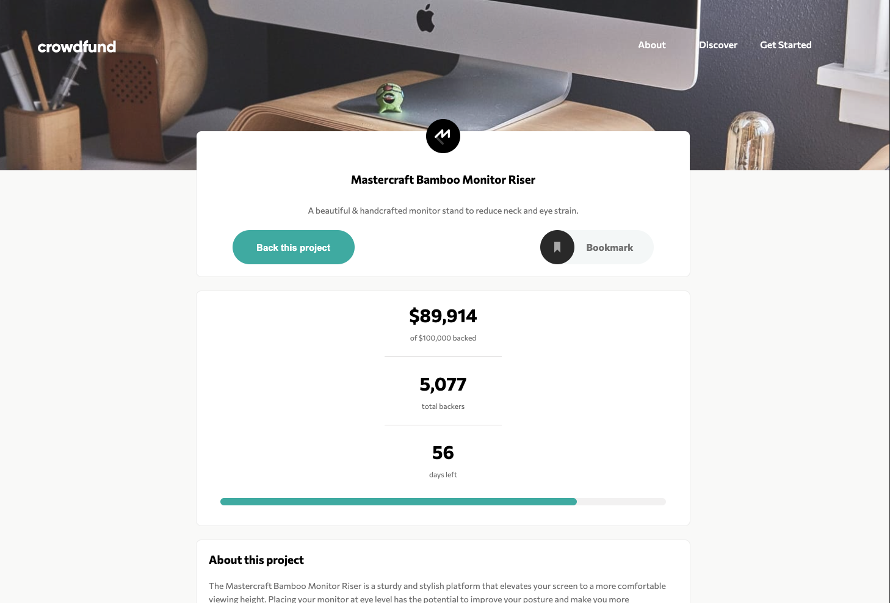

# Frontend Mentor - Crowdfunding product page solution

This is a solution to the [Crowdfunding product page challenge on Frontend Mentor](https://www.frontendmentor.io/challenges/crowdfunding-product-page-7uvcZe7ZR). Frontend Mentor challenges help you improve your coding skills by building realistic projects.

## Table of contents

- [Overview](#overview)
  - [The challenge](#the-challenge)
  - [Screenshot](#screenshot)
  - [Links](#links)
- [My process](#my-process)
  - [Built with](#built-with)
  - [What I learned](#what-i-learned)
  - [Continued development](#continued-development)
  - [Useful resources](#useful-resources)
- [Author](#author)
- [Acknowledgments](#acknowledgments)

## Overview

### The challenge

Users should be able to:

- View the optimal layout depending on their device's screen size
- See hover states for interactive elements
- Make a selection of which pledge to make
- See an updated progress bar and total money raised based on their pledge total after confirming a pledge
- See the number of total backers increment by one after confirming a pledge
- Toggle whether or not the product is bookmarked

### Screenshot

### Links

- Solution URL: [Github Repository](https://github.com/Barbelitos/FrontEndMentor-CrowdfundingProductPage)
- Live Site URL: [Live Site](https://barbelitos.github.io/FrontEndMentor-CrowdfundingProductPage/)

## My process

### Built with

- HTML 5
- CSS
- Flexbox
- Mobile-first workflow
- JavaScript
- DOM

### What I learned

This challenge was a good practice for JavaScript interaction with the DOM and and HTML, CSS.

### Continued development

I feel that I have developed further my skills in JavaScript and HTML/CSS with this interesting challenge.

### Useful resources

## Author

- Github - [@Barbelitos](https://github.com/Barbelitos)
- Frontend Mentor - [@Barbelitos](https://www.frontendmentor.io/profile/Barbelitos)

## Acknowledgments
